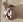

# Лабораторная работа №1
## Выполнил: Шенягин Даниил Б20-514

### Исходная картинка

### Интерполяция

### Децимация 

### Двухпроходная передескритизация

### Однопроходная передескритизация

### Исходная картинка

### Интерполяция

### Децимация 

### Двухпроходная передескритизация

### Однопроходная передескритизация

