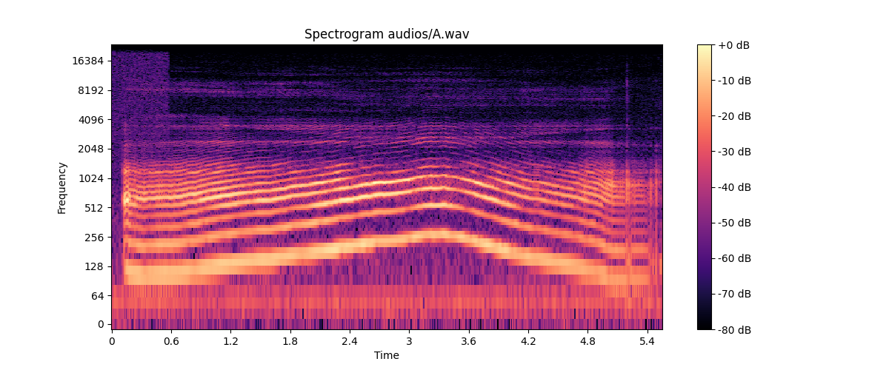
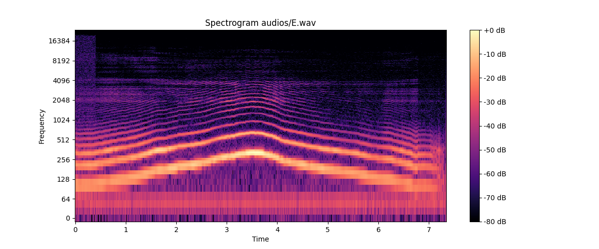
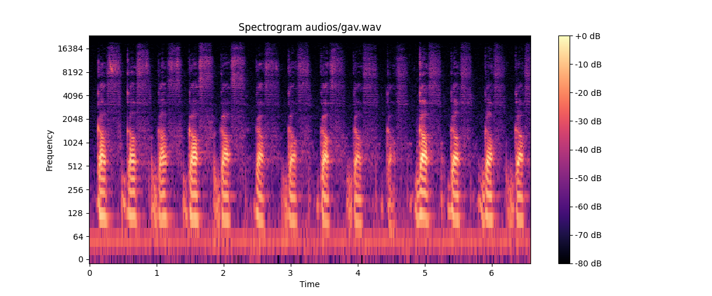

# Лабораторная работа №10
## Выполнил: Шенягин Даниил Б20-514

### Спектограмма буквы А

### Спектограмма буквы E

### Спектограмма Гава

### Характеристики
A
Минимальная частота голоса: 0
Максимальная частота голоса: 8368

E
Минимальная частота голоса: 7
Максимальная частота голоса: 4180

gav
Минимальная частота голоса: 6
Максимальная частота голоса: 12364