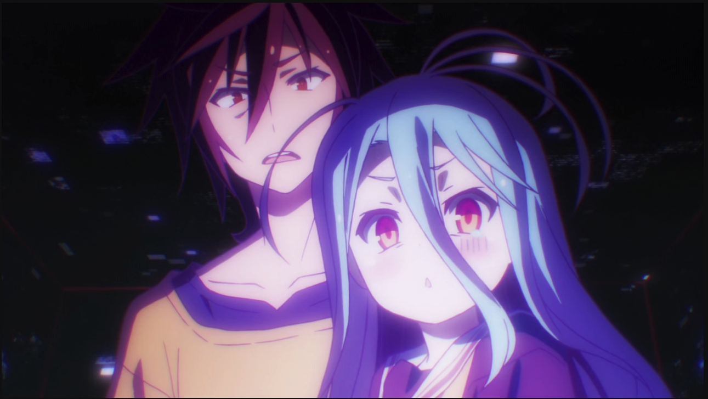
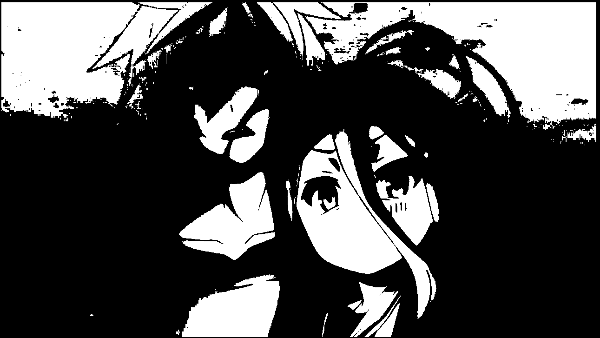
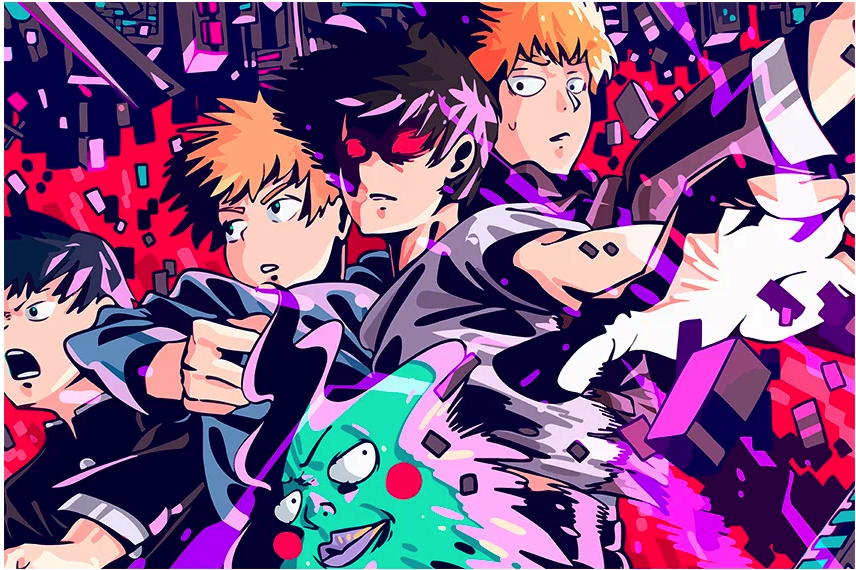

# Лабораторная работа №2
## Выполнил: Шенягин Даниил Б20-514

### Исходная картинка

### Оттенки серого

### Оттенки серого (как в Photoshop)

### Бинаризация (двух пороговая)

### Исходная картинка

### Оттенки серого

### Оттенки серого (как в Photoshop)

### Бинаризация (двух пороговая)

