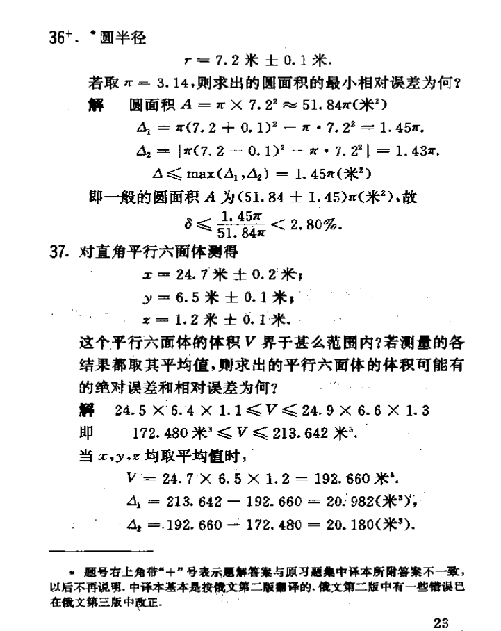
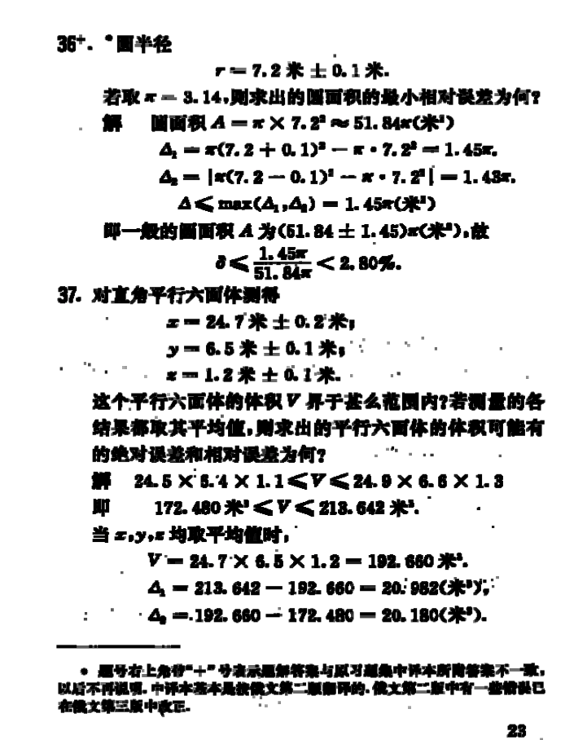
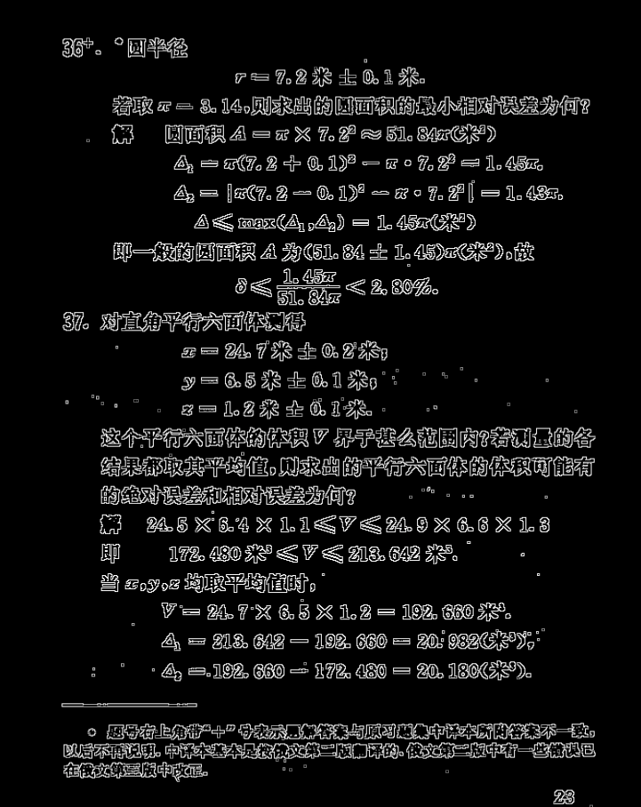
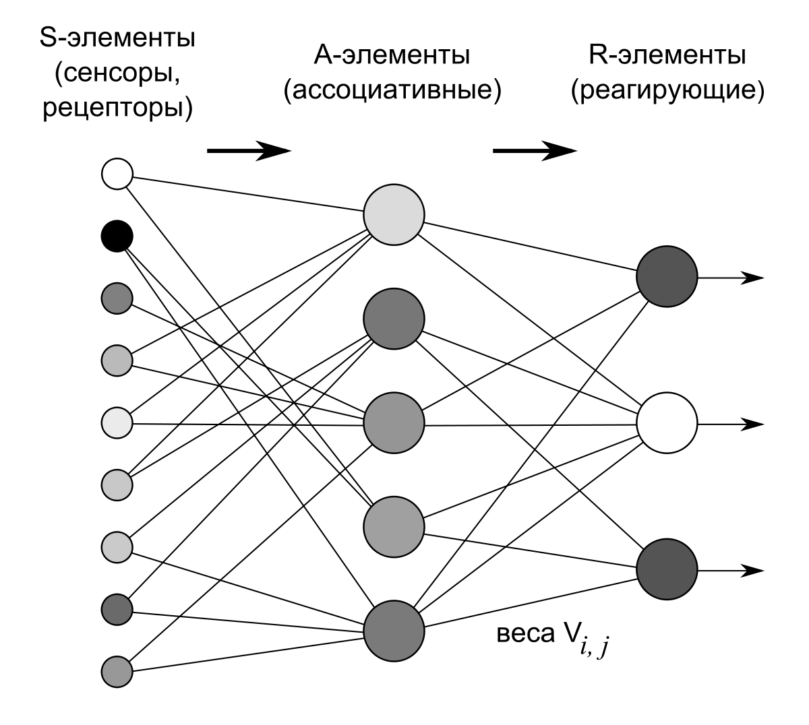
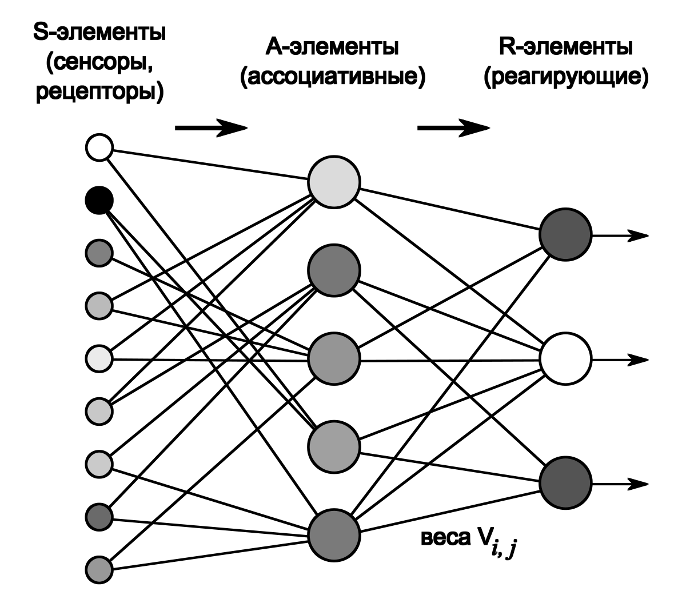
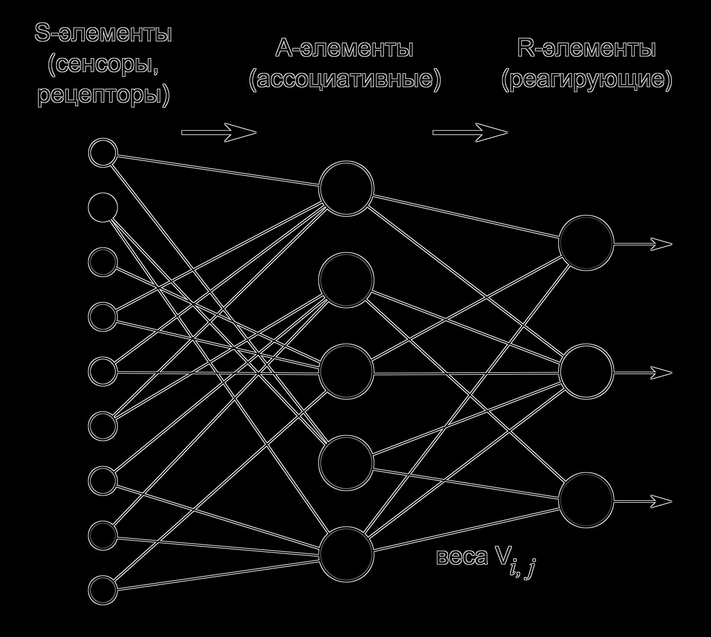

# Лабораторная работа №3
## Выполнил: Шенягин Даниил Б20-514
## вариант: 10

### Исходная картинка

### Применение фильтрации

### diff

### Исходная картинка

### Применение фильтрации

### diff

