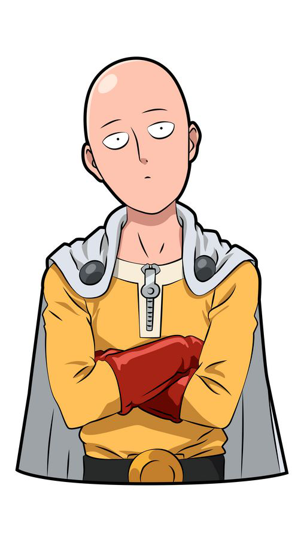
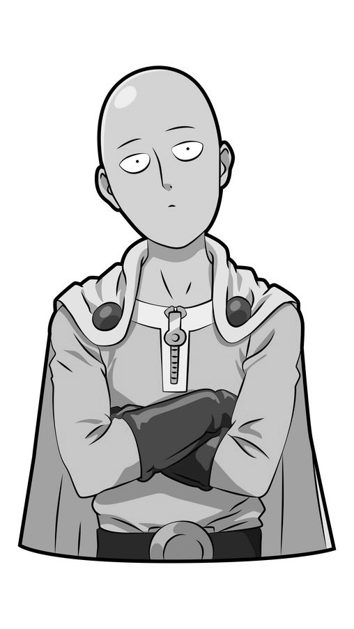
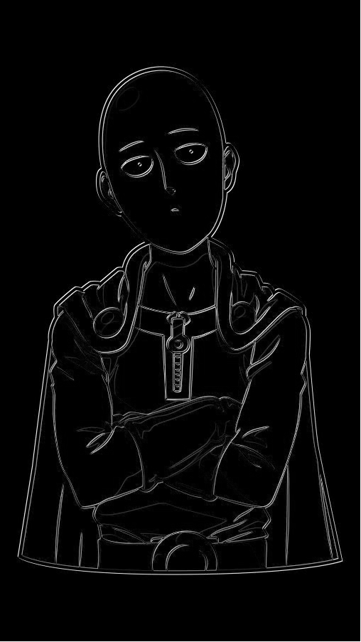
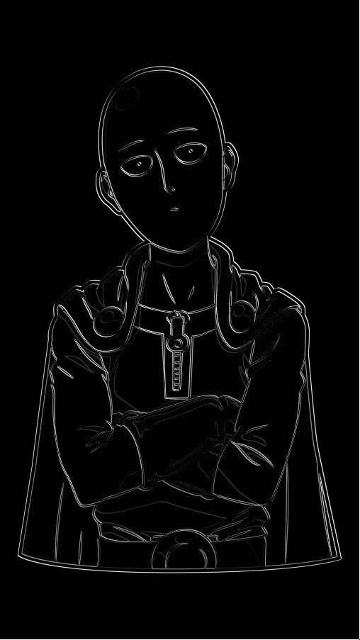
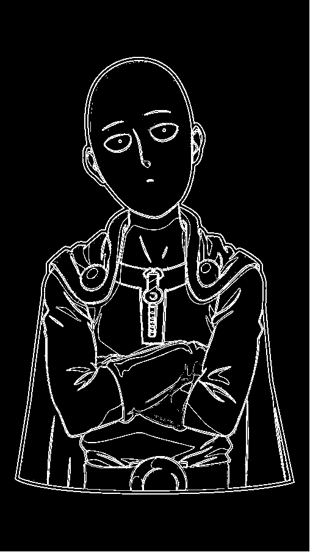
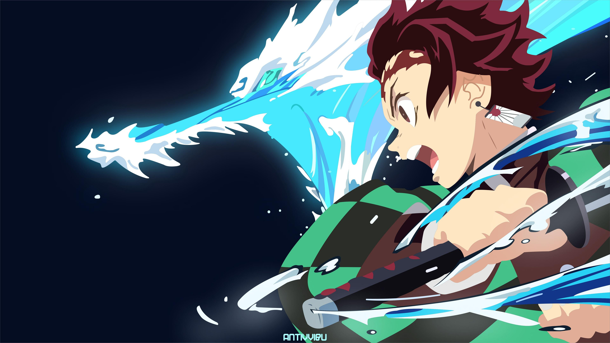
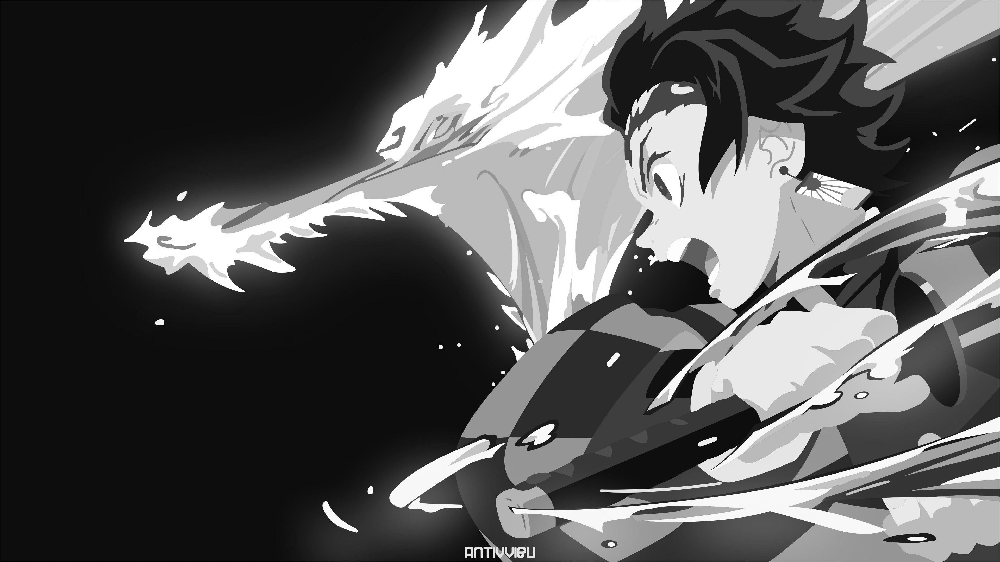
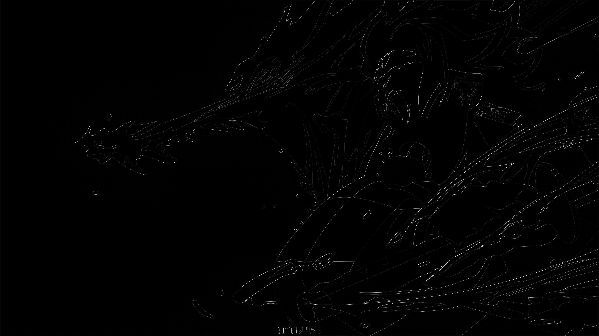
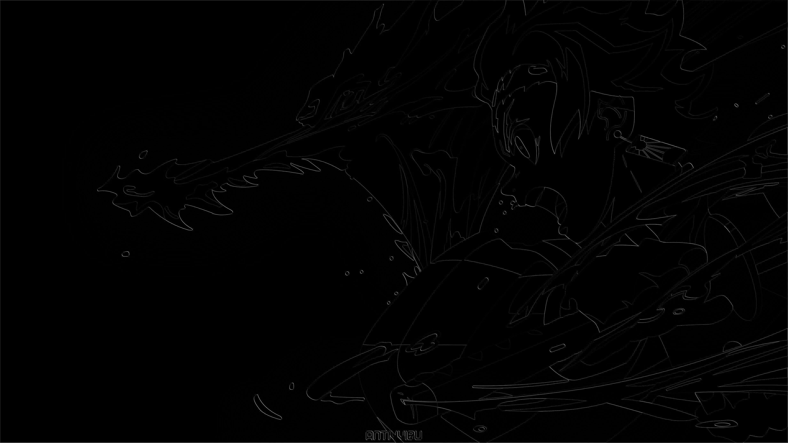
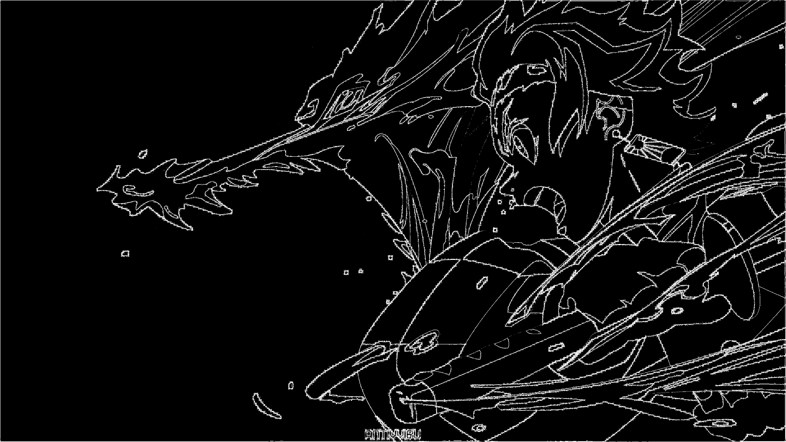

# Лабораторная работа №4
## Выполнил: Шенягин Даниил Б20-514

### Исходная картинка

### Grayscale image

### x image

### y image

### contour_selection

### Исходная картинка

### Grayscale image

### x image

### y image

### contour_selection

