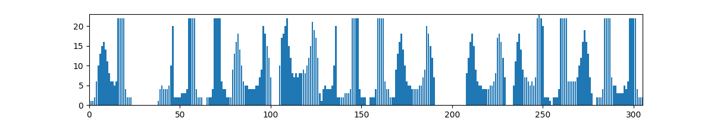

# Лабораторная работа №6
## Выполнил: Шенягин Даниил Б20-514

## Исходное предложение: `'я люблю оави'`

## X Profile

## Y Profile

## Result: `[(0, 23), (36, 62), (63, 100), (103, 152), (153, 190), (206, 229), (232, 254), (277, 278), (304, 305)]`

