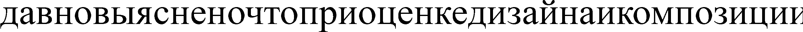

# Лабораторная работа №7
## Выполнил: Шенягин Даниил Б20-514
## variant: lower russian letters

## Исходная фраза: `'я люблю оави'`


## Распознавание текста:
```
(1, [('я', 0.97), ('и', 0.71), ('н', 0.69), ('в', 0.67), ('п', 0.64), ('к', 0.6), ('а', 0.55), ('х', 0.53), ('е', 0.52), ('л', 0.49), ('о', 0.48), ('ц', 0.45), ('ъ', 0.44), ('ч', 0.44), ('ь', 0.44), ('м', 0.41), ('д', 0.4), ('ё', 0.39), ('б', 0.38), ('з', 0.38), ('ы', 0.34), ('с', 0.31), ('р', 0.29), ('й', 0.27), ('ф', 0.27), ('ж', 0.25), ('э', 0.25), ('т', 0.22), ('щ', 0.16), ('ю', 0.15), ('ш', 0.04), ('у', 0.02), ('г', 0.0)])
(2, [('л', 0.93), ('ъ', 0.6), ('д', 0.6), ('х', 0.6), ('з', 0.59), ('ч', 0.58), ('э', 0.52), ('п', 0.52), ('о', 0.51), ('н', 0.49), ('я', 0.48), ('и', 0.45), ('ц', 0.43), ('т', 0.43), ('м', 0.41), ('ф', 0.39), ('б', 0.38), ('е', 0.34), ('а', 0.33), ('к', 0.32), ('р', 0.31), ('ы', 0.3), ('в', 0.3), ('ь', 0.28), ('щ', 0.26), ('ж', 0.24), ('с', 0.24), ('ё', 0.19), ('ю', 0.16), ('у', 0.15), ('й', 0.07), ('г', 0.02), ('ш', 0.0)])
(3, [('ю', 0.95), ('ж', 0.9), ('ш', 0.88), ('м', 0.81), ('ы', 0.79), ('щ', 0.72), ('п', 0.55), ('н', 0.54), ('и', 0.53), ('ъ', 0.53), ('ч', 0.53), ('х', 0.49), ('л', 0.46), ('т', 0.44), ('о', 0.43), ('я', 0.4), ('в', 0.39), ('к', 0.35), ('е', 0.29), ('р', 0.27), ('г', 0.27), ('ц', 0.27), ('а', 0.26), ('э', 0.26), ('ь', 0.25), ('с', 0.25), ('д', 0.22), ('з', 0.2), ('б', 0.2), ('у', 0.17), ('ф', 0.15), ('ё', 0.07), ('й', 0.0)])
(4, [('б', 0.93), ('е', 0.82), ('ф', 0.8), ('с', 0.78), ('а', 0.75), ('ь', 0.75), ('о', 0.7), ('ё', 0.66), ('р', 0.64), ('ъ', 0.59), ('к', 0.57), ('х', 0.56), ('я', 0.55), ('в', 0.55), ('з', 0.55), ('н', 0.53), ('п', 0.53), ('и', 0.52), ('л', 0.5), ('д', 0.49), ('ц', 0.49), ('у', 0.46), ('й', 0.45), ('э', 0.45), ('т', 0.42), ('г', 0.42), ('ч', 0.37), ('м', 0.31), ('ы', 0.28), ('ж', 0.2), ('ю', 0.14), ('щ', 0.14), ('ш', 0.0)])
(5, [('л', 0.93), ('ъ', 0.6), ('д', 0.6), ('х', 0.6), ('з', 0.59), ('ч', 0.58), ('э', 0.52), ('п', 0.52), ('о', 0.51), ('н', 0.49), ('я', 0.48), ('и', 0.45), ('ц', 0.43), ('т', 0.43), ('м', 0.41), ('ф', 0.39), ('б', 0.38), ('е', 0.34), ('а', 0.33), ('к', 0.32), ('р', 0.31), ('ы', 0.3), ('в', 0.3), ('ь', 0.28), ('щ', 0.26), ('ж', 0.24), ('с', 0.24), ('ё', 0.19), ('ю', 0.16), ('у', 0.15), ('й', 0.07), ('г', 0.02), ('ш', 0.0)])
(6, [('ю', 0.95), ('ж', 0.9), ('ш', 0.88), ('м', 0.81), ('ы', 0.79), ('щ', 0.72), ('п', 0.55), ('н', 0.54), ('и', 0.53), ('ъ', 0.53), ('ч', 0.53), ('х', 0.49), ('л', 0.46), ('т', 0.44), ('о', 0.43), ('я', 0.4), ('в', 0.39), ('к', 0.35), ('е', 0.29), ('р', 0.27), ('г', 0.27), ('ц', 0.27), ('а', 0.26), ('э', 0.26), ('ь', 0.25), ('с', 0.25), ('д', 0.22), ('з', 0.2), ('б', 0.2), ('у', 0.17), ('ф', 0.15), ('ё', 0.07), ('й', 0.0)])
(7, [('о', 0.92), ('ъ', 0.73), ('е', 0.65), ('в', 0.61), ('р', 0.6), ('н', 0.59), ('п', 0.58), ('и', 0.58), ('б', 0.55), ('с', 0.54), ('х', 0.52), ('я', 0.51), ('л', 0.51), ('а', 0.5), ('ь', 0.49), ('м', 0.46), ('т', 0.44), ('ф', 0.43), ('ч', 0.41), ('к', 0.41), ('ы', 0.4), ('э', 0.38), ('з', 0.38), ('ж', 0.32), ('г', 0.32), ('ц', 0.27), ('ю', 0.25), ('д', 0.25), ('у', 0.24), ('ё', 0.23), ('щ', 0.2), ('ш', 0.08), ('й', 0.0)])
(8, [('а', 0.87), ('ь', 0.78), ('е', 0.78), ('к', 0.73), ('я', 0.69), ('в', 0.66), ('и', 0.64), ('н', 0.63), ('ё', 0.63), ('с', 0.61), ('б', 0.61), ('п', 0.59), ('о', 0.58), ('х', 0.54), ('ъ', 0.5), ('ф', 0.48), ('й', 0.46), ('ц', 0.41), ('л', 0.4), ('р', 0.39), ('д', 0.35), ('з', 0.34), ('м', 0.32), ('ы', 0.32), ('ч', 0.29), ('т', 0.23), ('ж', 0.21), ('э', 0.21), ('г', 0.19), ('у', 0.18), ('ю', 0.12), ('щ', 0.06), ('ш', 0.0)])
(9, [('в', 0.91), ('я', 0.74), ('и', 0.63), ('н', 0.59), ('е', 0.57), ('о', 0.55), ('а', 0.54), ('п', 0.53), ('к', 0.49), ('ь', 0.47), ('ъ', 0.45), ('б', 0.4), ('х', 0.39), ('м', 0.39), ('л', 0.38), ('с', 0.37), ('ы', 0.36), ('р', 0.35), ('ё', 0.33), ('з', 0.32), ('ч', 0.32), ('ц', 0.27), ('ф', 0.26), ('ж', 0.26), ('э', 0.24), ('д', 0.23), ('т', 0.18), ('ю', 0.16), ('й', 0.16), ('щ', 0.1), ('ш', 0.07), ('г', 0.06), ('у', 0.0)])
(10, [('и', 0.92), ('н', 0.89), ('п', 0.81), ('я', 0.77), ('к', 0.63), ('х', 0.62), ('в', 0.61), ('м', 0.55), ('а', 0.51), ('о', 0.5), ('ъ', 0.5), ('е', 0.49), ('ы', 0.48), ('ч', 0.45), ('л', 0.45), ('ь', 0.41), ('ж', 0.39), ('ц', 0.38), ('с', 0.31), ('б', 0.3), ('ю', 0.28), ('д', 0.26), ('т', 0.25), ('р', 0.25), ('ё', 0.25), ('щ', 0.24), ('з', 0.2), ('ф', 0.17), ('ш', 0.15), ('э', 0.11), ('й', 0.11), ('г', 0.05), ('у', 0.0)])

```

### test: `давновыясненочтоприоценкедизайнаикомпозициичитаемыйтекстмешаетсосредоточитьсячтототобеспечиваетболееилименеестандартноезаполнениешаблона`



## recognize metric

```
д д
а а
в в
и н
о о
в в
ы ы
я я
с с
и н
е е
и н
о о
ч ч
т т
о о
п п
р р
и и
о о
ц ц
е е
и н
к к
е е
д д
и и
з з
а а
й й
и н
а а
и и
ш к
м о
п м
о п
з о
и з
ц и
и ц
й и
Metric:  66.66666666666666
```