# Лабораторная работа №8
## Выполнил: Шенягин Даниил Б20-514

## вариант: 6
## Параметры матрицы Харалика: d=2, phi = {0, 90, 180, 270}
## Расчёт признаков: CON, LUN
## Метод преобразования яркости: Логарифмическое

### Исходная картинка

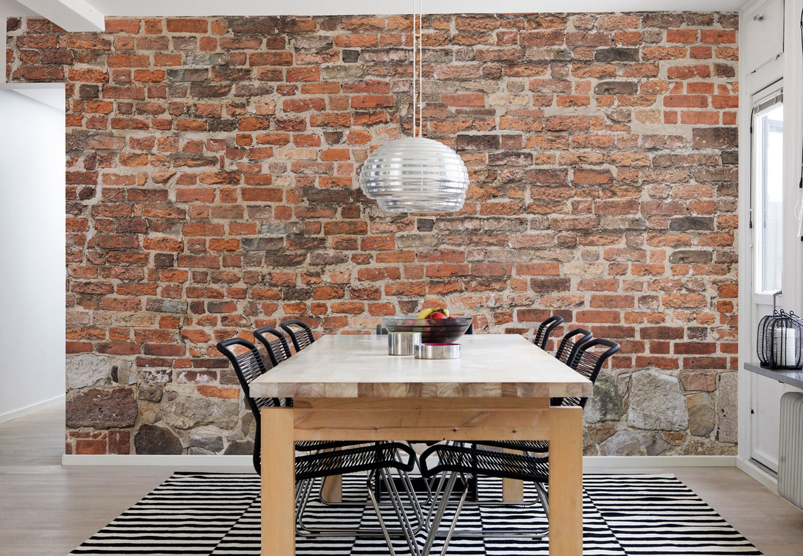

### Grayscale image

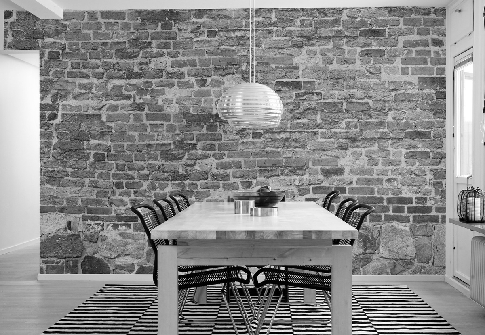

### Contrast image

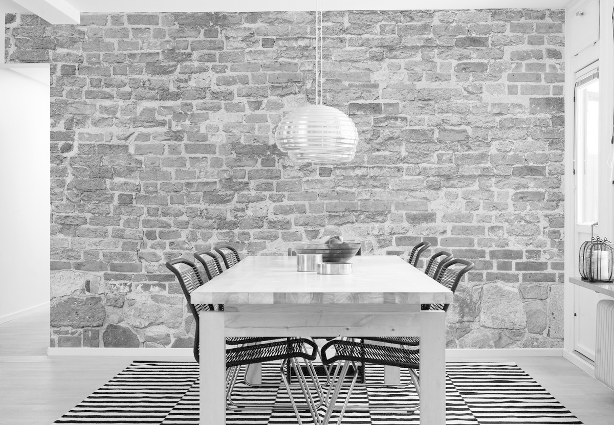 

### Raralic source

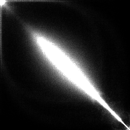

### Raralic contrast

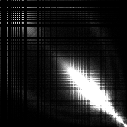

### Histogram source

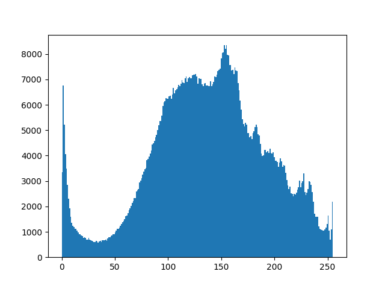

### Histogram contrast

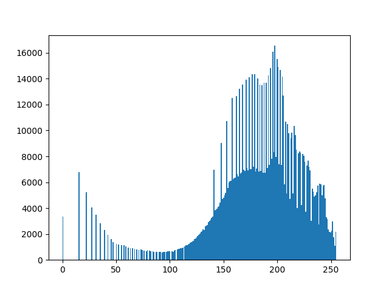

### Исходная картинка

### Grayscale image

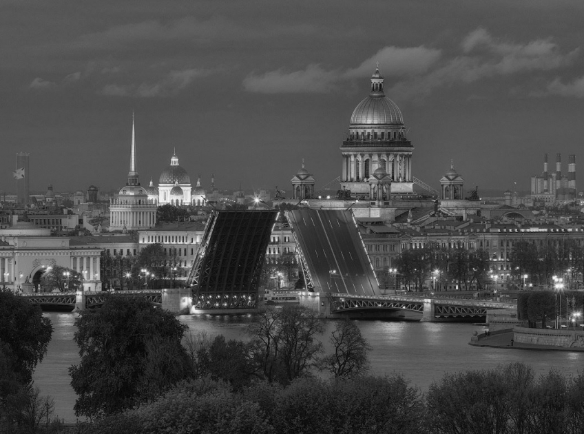

### Contrast image

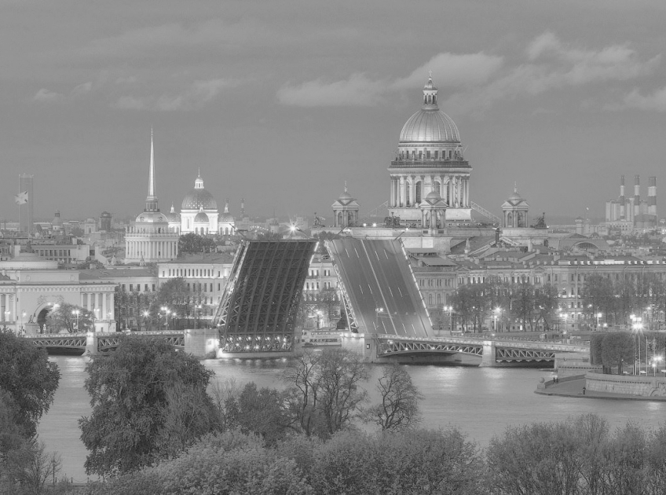 

### Raralic source

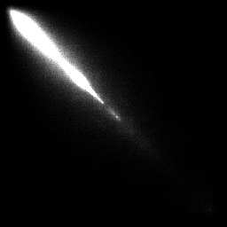

### Raralic contrast

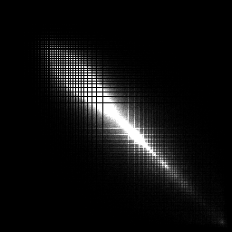

### Histogram source

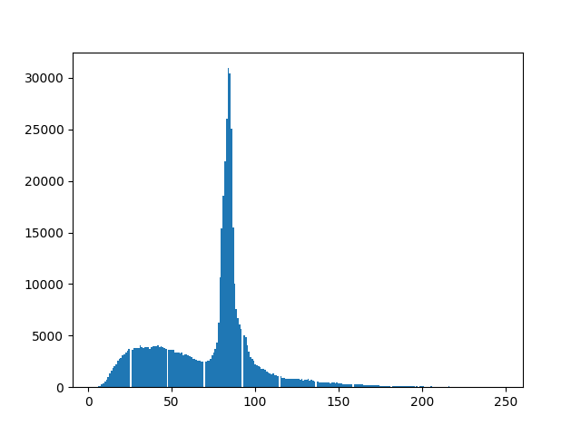

### Histogram contrast

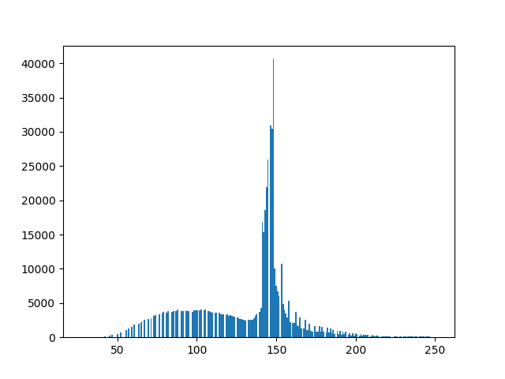