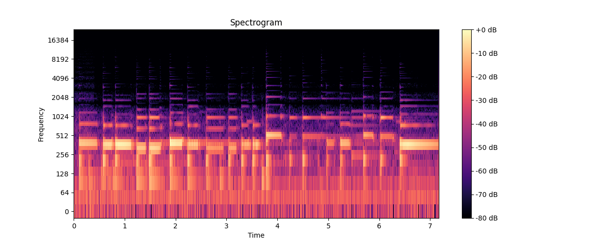
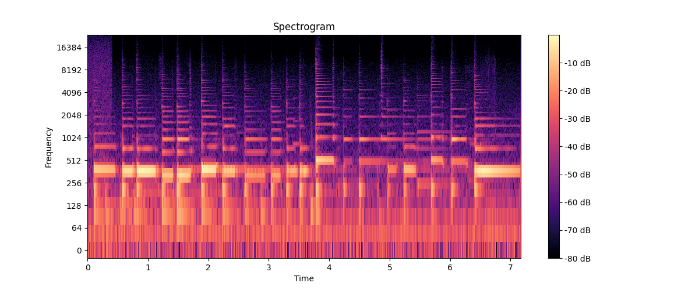
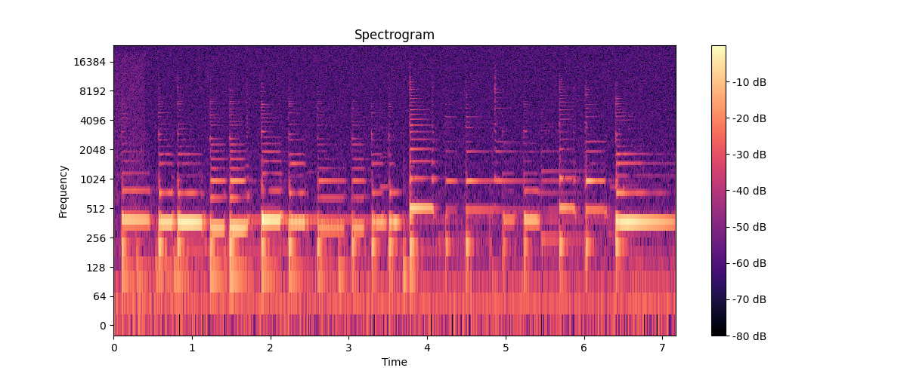

# Лабораторная работа №9
## Выполнил: Шенягин Даниил Б20-514

### Исходный трек

### Применение фильтра savgol

### Применение фильтра savgol wiener

### Применение шума для дальнейшей обработки

### Применение фильтра savgol к треку с шумом

